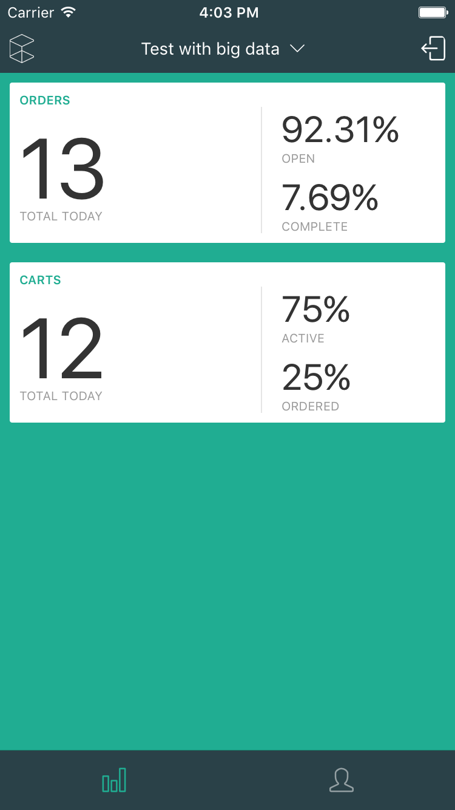
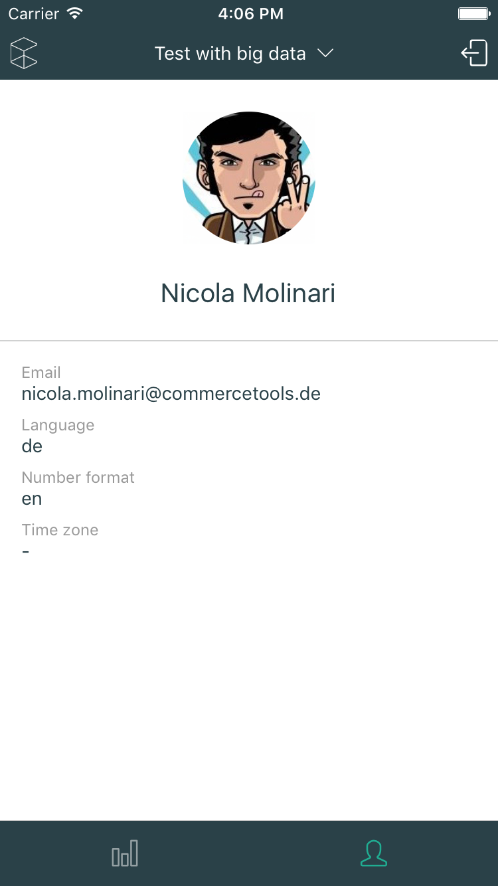

### Tech Day project
Build an iOS / Android Dashboard App in React Native.





### Installation
Ensure you have the [necessary tools and dependencies](https://facebook.github.io/react-native/docs/getting-started.html) to develop an application.

Once you're setup, simply run

```bash
$ yarn # or npm install
$ react-native link # configure native package dependencies
$ react-native run-ios # this will start the native packager and spawn the iOS simulator
```

Alternatively, simply open the project in Xcode and run it from there.


#### TODOs
- better project switcher (show inactive projects)
- persist dashboard data as well
- fading animation for placeholder elements
- unit tests
- flow types
- fetch meta data from other days as well?
- fetch other data (customers, products, ...)?
- better error notifications
- small example of push notification when new orders come in
